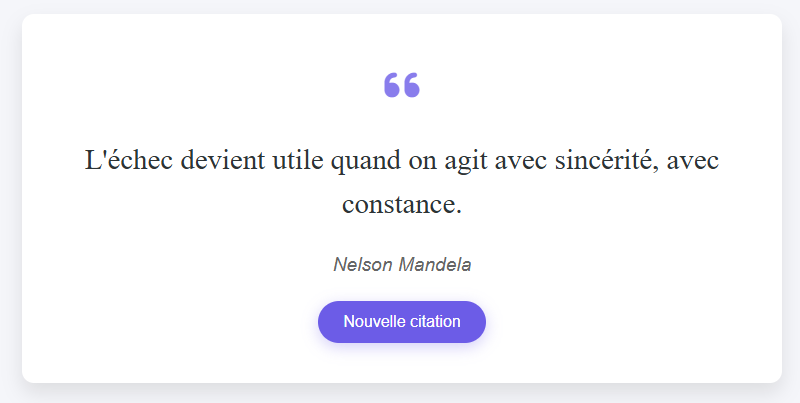

# CITATIONS

## Description
Application web permettant d’afficher des citations de manière aléatoire à partir d’un fichier **JSON local**.  
Ce projet est le **cinquième** du défi personnel **100 projets en 2026**.

---

## Objectifs du projet
- Charger et parser un fichier JSON local
- Manipuler le DOM dynamiquement avec JavaScript
- Générer un contenu aléatoire
- Concevoir une interface web simple et agréable

---

## Plateforme
- Web (navigateur)

---

## Technologies utilisées
- HTML
- CSS
- JavaScript (Vanilla)
- Fichier JSON local pour les données

---

## Fonctionnalités
- Chargement des citations depuis un fichier JSON
- Sélection aléatoire d’une citation
- Affichage du texte et de l’auteur
- Bouton **“Nouvelle citation”**
- Interface responsive

---

## Design & UX
- Interface minimaliste et élégante
- Carte centrée pour la citation
- Animation légère lors du changement de citation
- Utilisation fluide sur mobile et desktop

---

## Captures d’écran

---

## Ce que j’ai appris
- Lecture et parsing de fichiers JSON en JavaScript
- Manipulation dynamique du DOM
- Génération aléatoire
- Organisation simple des données

---

## Améliorations possibles
- Ajout de catégories de citations
- Mode sombre
- Favoris
- Chargement depuis une API externe

---

## Statut du projet
 **Projet terminé**
